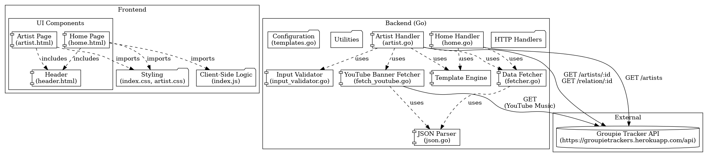

# Groupie Trackers

Groupie Trackers is a project that uses a provided API to manipulate and display data in a user-friendly website. The application organizes information about bands, artists, concert locations, and dates while implementing client-server communication for interactive features.

---

## Overview

The API consists of four main endpoints:
1. **Artists**: Provides details about bands and artists, including their names, images, year of activity commencement, first album date, and band members.
2. **Locations**: Lists the past and upcoming concert locations of the artists.
3. **Dates**: Lists the past and upcoming concert dates.
4. **Relation**: Links the artists, concert locations, and concert dates.

### Goal
To build a dynamic website that displays this data using various visualization techniques (blocks, cards, tables, lists, pages, graphics, etc.) and includes interactive features based on client-server communication.

---

## Features

### Frontend
- **Artist Page**: Displays detailed information about individual artists and their concert history.
- **Home Page**: Offers an overview of all artists with quick access to their profiles.
- **UI Components**: Includes a header, shared styling, and JavaScript for dynamic content.

### Backend (Go)
- **Data Handlers**: Processes requests for artist data, homepage data, and API integration.
- **Utilities**: Handles input validation, data fetching, and template rendering for server-side logic.
- **API Integration**: Fetches data from the external Groupie Trackers API and formats it for frontend display.

### Event/Action System
- Implements a client-server interaction where a user-triggered event (e.g., clicking on an artist or searching for a location) fetches live data from the server and updates the website dynamically.

---

## Architecture

The architecture of the project is represented below:




## How to Run the Project

1. **Clone the Repository**:
   ```
   git clone https://github.com/xySaad/groupie-tracker.git
   cd groupie-tracker
   ```

2. **Run the Backend**:
   ```
   go run ./app
   ```

3. **Access the Application**:
   Open a browser and navigate to `http://localhost:8080`.

---

## Learning Objectives

By completing this project, you will gain proficiency in:
- Manipulating and storing data in Go.
- Parsing and utilizing JSON files.
- Building dynamic websites with HTML and Go templates.
- Creating client-server interactions using request-response architecture.

---

For more information, consult the [API Documentation](https://groupietrackers.herokuapp.com/api).
